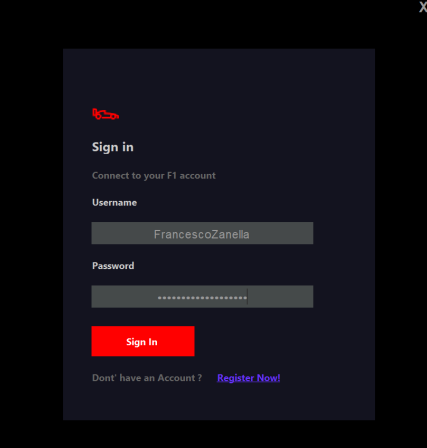
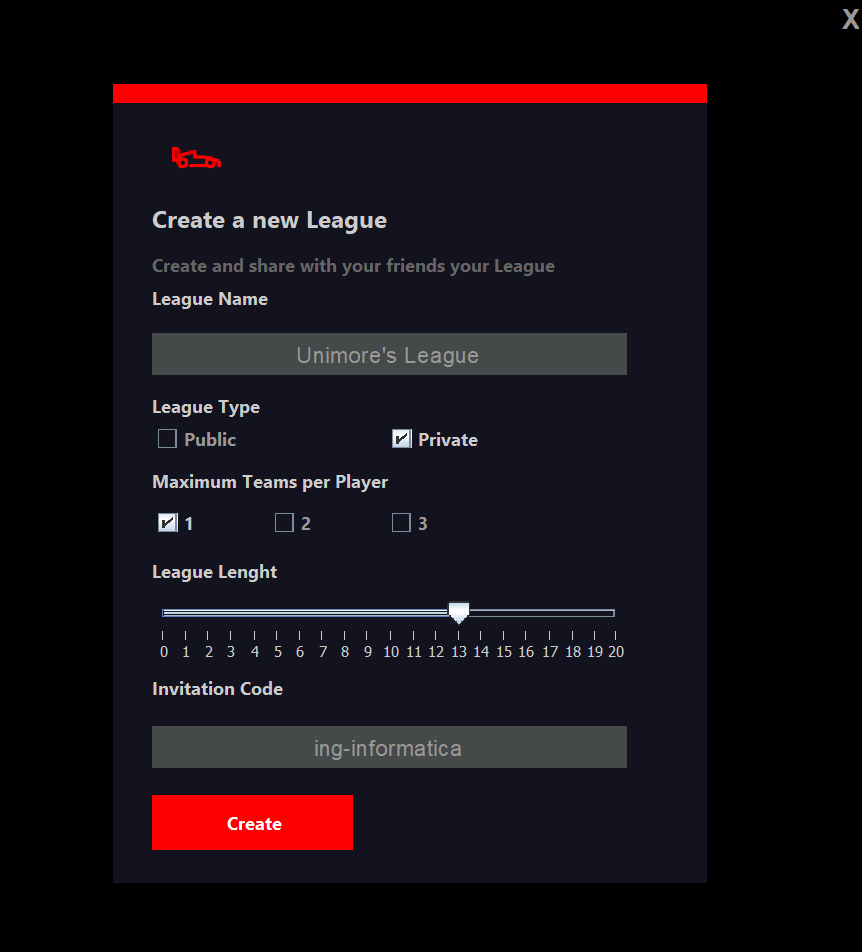
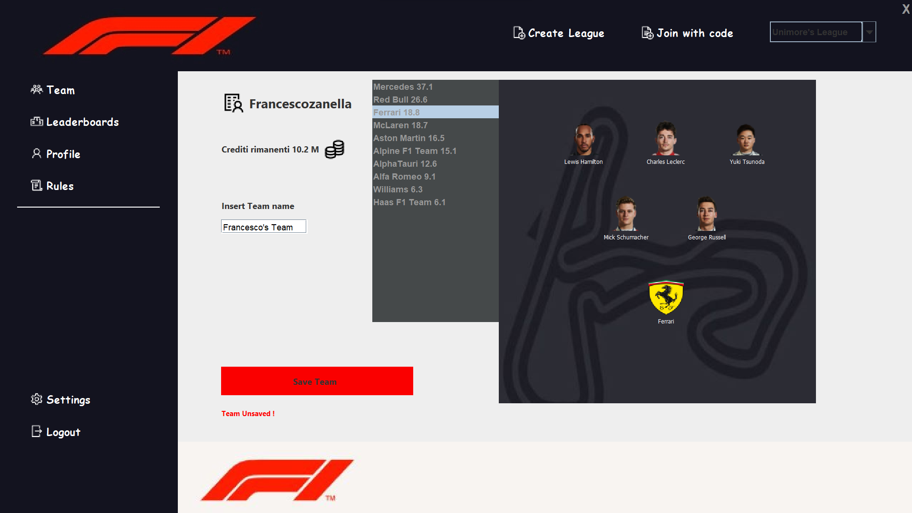
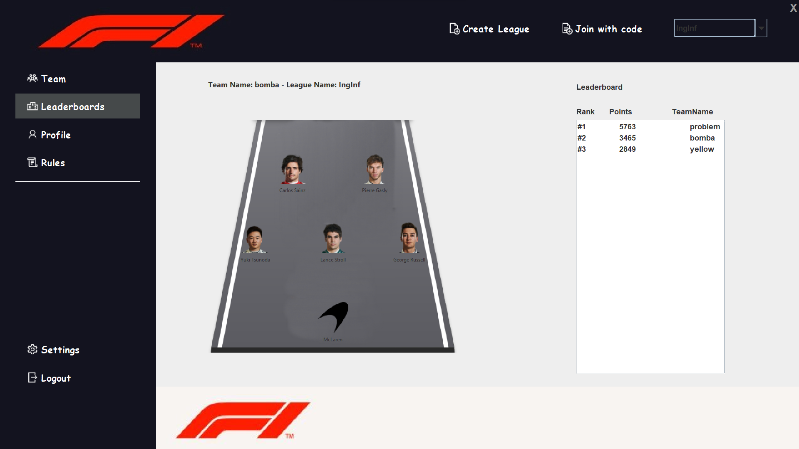

# FantaF1
FantaF1’s goal is to give users a way to compete against friends and Formula1 fans creating
the best team and collecting points every weekend.


## Prerequisites

Before you begin with the installation, make sure you have the following prerequisites in place:

- **Java Development Kit (JDK)**
  - You'll need to have Java JDK installed on your system. If you don't have it installed, you can download and install it from [Oracle's JDK](https://www.oracle.com/java/technologies/javase-downloads.html) or [OpenJDK](https://openjdk.java.net/install/) based on your preference.

- **Git**
  - Git is required to clone the repository and manage the source code. If you don't have Git installed, you can download it from [Git Downloads](https://git-scm.com/downloads).

Make sure these prerequisites are properly installed and configured on your system before proceeding with the installation.


# Installation Guide
To get started, follow these simple steps:

1. **Clone the Repository**
   - Begin by cloning the project's repository to your local machine. You can do this by running the following command in your terminal:

     ```
     git clone https://github.com/FrancescoZanella/F1_oop.git
     ```

2. **Run the Application**
   - After having cloned the application, you can run it using the following command:

     ```
     java -jar F1_oop.jar
     ```
## Table of Contents

- [1. FantaF1’s Goal](1)
- [2. How to Play](#12-how-to-play)
  - [2.1 Teams](#121-teams)
  - [2.2 Budget](#122-budget)
  - [2.3 Subs Bank](#123-subs-bank)
  - [2.4 Leagues](#124-leagues)
  - [2.5 Points Scoring](#125-points-scoring)
  - [2.6 Results](#126-results)

## 1. FantaF1’s Goal{1}

FantaF1's goal is to provide users with an exciting platform to compete against friends and Formula 1 enthusiasts by creating the best team and earning points based on real-world Formula 1 events.

## 2. How to Play

### 2.1 Teams

- You start with an initial budget of 100 million units to assemble a team consisting of 5 drivers and 1 constructor.
- Your team's performance is based on the real-world Formula 1 events, including qualifying, races, and sprints.
- There are no restrictions on selecting drivers from specific teams, and you can make changes to your team before the season starts.
- Your team can be managed throughout the season using your Subs Bank and chips as described below.
- The last saved version of your team each week is entered into all the leagues you've joined.
- You can manage up to 3 teams per season.

### 2.2 Budget

- Initially, you have a budget of 100 million units to spend on drivers and a constructor.
- The prices of your drivers and constructor may change throughout the season, affecting your Total Value.
- You can lock in a price increase by removing a driver or constructor from your team, freeing up budget for other selections.
- Budgets of F1 Fantasy users may vary as the season progresses.

### 2.3 Subs Bank

- The Subs Bank allows you to make up to 6 substitutions to your team each Raceweek before the Lock time.
- The first 3 substitutions each Raceweek are free, while additional substitutions result in a penalty of -10 points per substitution.
- Your Subs Bank is reduced by one each time you save a substitution.
- You can only make as many substitutions as your Subs Bank allows before the Lock time.
- Unused substitutions do not carry forward to the following Raceweek.

### 2.4 Leagues

- Leagues enable groups of users to enter their teams and compete for top positions in the league leaderboard.
- Your Team 1 is automatically entered into the Global League, the League of your home country, and the League of your favorite Formula 1 team.
- You can create and enter private or public leagues with your friends. These leagues can be single-entry, double-entry, or triple-entry.
- Leagues can be joined via unique league codes.
- You can join up to 250 leagues each season.

### 2.5 Points Scoring

- Points are scored based on the performance of your selected drivers and constructor in real-world Formula 1 sessions.
- All 5 drivers and 1 constructor contribute to your team's points based on the Points Scoring table.
- Points are updated in real-time during live Formula 1 sessions.

### 2.6 Results

- Results for each Raceweek are confirmed shortly after all Formula 1 sessions conclude.
- League leaderboards update shortly afterward, allowing you to see how you performed against friends and the general public.

# Screenshots

Here are some screenshots of the FantaF1 application to give you a glimpse of its user interface and features:

**Login:**



*Description:When the application is launched the following page is shown. The user has to fill in the blanks
to log*

**Create League:**



*Description: If a user wants to create a new league he must use this page, he has to specify the league name,
the league lenght, how many races compose the league, the scope, a league can be either private
or public and the invitation code to share with others users.*

**Home Page:**
In the homepage users can browse all app’s sections which are Team, LeaderBoard, Profile,
Rules, Settings and Logout.



*Description: In the homepage users can also use the buttons "join with code" to join an existent league
with an invitation code or "create league" to create a customized new one*

**Leaderboard:**




*Description: Each league has a leaderboard where users’ team are sorted based on fantapoints assigned
after each raceweek.
*


    


